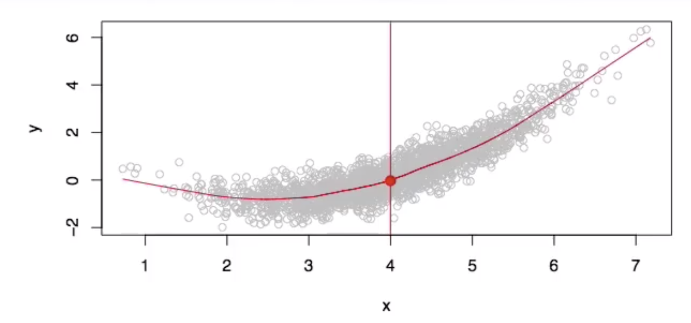
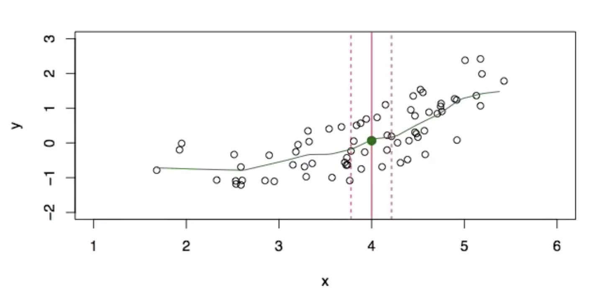

# 第二章 统计学习

[视频地址](https://www.bilibili.com/video/av60874013/?p=3)

## 2.1 什么是统计学习

图中显示的是销售额与电视、广播和报纸的散点图，其中蓝色直线是拟合线。
我们能否用这 3 种数据去预测销售额？
也许我们在这儿可以使用模型会做的更好
$$ Sales \approx f(TV,Radio,Newspaper) $$

**符号**
$ Sales $是我们需要预测的响应变量或者是目标，通常用符号$Y$表示。
$ TV $是属性、输入、或者预测变量，我们用$X_1$表示，同理将$ Radio $用 $ X_2 $表示，$ newspaper $用$ X_3 $表示。
因此，输入向量则可以表示为：
$$
X =  \begin {pmatrix} X_1 \\ X_2 \\ X_3 \end{pmatrix} \quad
$$

模型则可表示为：
$$
Y = f(X)+ \varepsilon
$$

$\varepsilon$ 是随机误差项。

### 2.1.1 $f(x)$的用途

- 通过$f$，可以在$X=x$时预测其对应的$Y$

- $X=(X_1,X_2,...,X_p)$其中的一些元素对$Y$的影响非常重要，有的元素对$Y$的影响很小。例如，专业资质和受教育程度对收入有很大的影响，可是婚姻状态通常不会
- 依靠$f$的结构，我们可以看出$X$中的任何一个$X_j$对 $Y$的影响

在下面的散点图中，我们有一个非常大的族群（数据集），在这种情况下仅有一个自变量$X$和响应变量$Y$。在这个散点图中大概有 2000 个点，我们可以将其想像为一个非常大的族群（数据集），思考怎样去找到一个理想的$f$。

一个理想的函数$f(x)$可以做到，对于任意的$X$,可以得到$Y$值。而从图中可以看出，当$x=4$时，这时有非常多的$Y$值，而最好的$ Y $输出应该是:
$$
f(4)=E(Y|X=4)
$$
$E(Y|X=4)$表示给定$x=4$的$ Y $的期望(均值)
这一理想的函数$f(x)=E(Y|X=x)$ 称为回归函数
如果在散点图中每一个$ X_i $出都取出期望$ Y_i $,连起来就是散点图中的红色曲线

**回归函数**

- 当$ x $变成一组向量时，$ Y $的期望这时就变成$ X $的各个元素的总的期望，即：

$$f(x)=f(x_1,x_2,x_3) = E(Y|X_1=x_1,X_2=x_2,X_3=x_3)$$

- 我们说关于$ Y $的最理想和最佳的预测器，这以为这我们要关注损失函数（loss function），也就意味着关于$X $的函数$f$将要最小化误差平方和。因此写出了期望的另一个形式$E[(Y-g(x))^{2}|X=x]$。在每个点$ X $处， 对应的$ Y $值减去所有的函数$ g$对应的值，因此其最小化了误差。

- $\varepsilon =Y-f(x)$是不可约误差（irreducible error）。即使得到一个$f $的精确估计，预测仍然会存在误差。按照定义，$\varepsilon$是不能用 $X$去预测的，因此我们无法减少$\varepsilon$引起的误差。
- $\hat { f } (x)$表示对$f(x)$的估计，于是很容易证明：

$$
\begin{aligned}
E(Y-\hat{Y})^{2}&=E[f(x)+\varepsilon-\hat{f}(x)]^{2}\\
&=\underbrace{[f(x)-\hat{f}(x)]^{2}}_{可约误差}+\underbrace{Var(\varepsilon)}_{不可约误差}
\end{aligned}
$$

$E(Y-\hat{Y})^{2}$代表测量值和实际值$Y$的均方误差或期望平均误差值，$Var(\varepsilon)$表示误差项$\varepsilon$的方差

### 2.1.2 如何估计$f$

下图是少量数据的散点图，可以看出但我们使用$X=4$时对应的期望$E(Y|X=4)$来表达输出$f(4)$时，因为此时恰好$X=4$是缺失的，因此有一个聪明的方法是取$ X=4 $邻近区域的期望或平均，因此可以将$f$ 表达为：
$$
\hat{f}(x)=Ave(Y|X \epsilon \Nu(x))
$$
其中，$\Nu(x)$表示$x$的邻近值。

